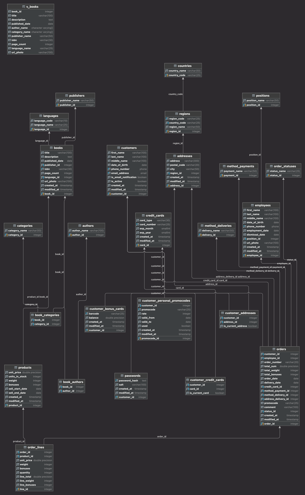

#  База данных Bookshop_online для PostgresSQL

Bookshop_online представляет из себя простую реализацию базы данных онлайн магазина книг для PostgreSQL.

## ER диаграмма



Онлайн диаграмма [тык](https://www.yworks.com/yed-live/?file=https://gist.githubusercontent.com/TuralMukhdarov/919e54af520721bca93a9779896ce86a/raw/d9da3d67d28c753609d2320bad37f0e91bc4ebbd/Imported%20Document)

## Описание БД

В базе данных содержится 25 таблиц и 1 представление. Объекты хранятся в схемах.


| Схема      | Таблица                                                                                                                                                         | Описание                                            |
|------------|-------------------------------------------------------------------------------------------------------------------------------------------------------------------|-----------------------------------------------------|
| book       | authors, book_authors, book_categories, books, categories, languages, publishers                                                                                  | книги, жанры и авторы                               |
| hr         | employees, positions                                                                                                                                              | сотрудники и должности                              |
| person     | addresses, countries, customer_addresses, customers, passwords, regions                                                                                           | клиенты, адреса и пароли                            |
| production | products                                                                                                                                                          | продукция                                           |
| sales      | credit_cards, customer_bonus_cards, customer_credit_cards, customer_personal_promocodes, method_deliveries, method_payments, order_lines, order_statuses, orders  | заказы, кредитные карты, промокоды и бонусные карты |

## Способ установки

### Ручной

Используйте дамп **init.sql** чтобы восстановить базу данных.
Для этого можно использовать утилиту psql или IDE, например DataGrip.

#### Восстановление с помощью утилиты **psql** для **Linux/MacOS**:

- Создать пустую БД
    ```
    psql -U postgres -c "CREATE DATABASE bookshop_online;"
    ```
- Восстановить БД из дампа
    ```
    psql -U postgres -d bookshop_online -f ./init.sql
    ```
#### Восстановление с помощью утилиты **psql** для **Windows**:

- Создать пустую БД
    ```
    .\psql.exe -U postgres -c "CREATE DATABASE bookshop_online;"
    ```
- Восстановить БД из дампа
    ```
    .\psql.exe -U postgres -d bookshop_online -f "C:\Temp\database_bookshop_online\scripts\init.sql"

### Docker

Перейти в папку с проектом и выполнить команды для запуска PostgreSQL с БД в контейнере.

- Создать образ и запустить контейнер на основе файла [Docker Compose](docker-compose.yaml)
    ```
    docker-compose up -d
    ```
- Подключиться к контейнеру
    ```
    docker-compose exec db /bin/bash
    ```
- Подключиться к БД
    ```
    psql -U postgres -d bookshop_online
    ```
  
## Датасет

Для генерации данных в БД использовались следующие ресурсы:
- https://www.mockaroo.com
- https://generatedata.com/generator

Данные о книгах для таблицы **books** были взяты из проекта:
- https://github.com/do-community/mongodb-resources/blob/main/datasets/books.json